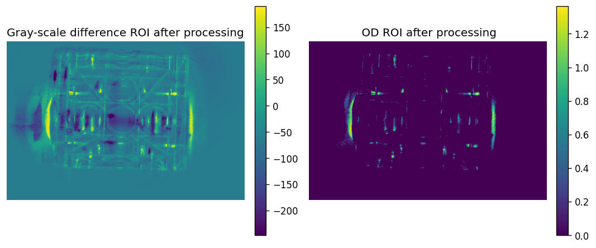
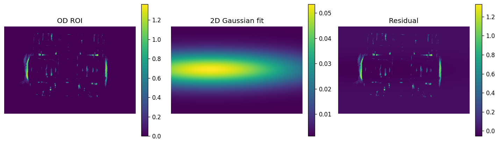

# coldatom-CCDimage-procession


用于冷原子吸收成像实验的数据分析工具。当前仓库在原项目基础上加入了面向实验数据分析的 `main.ipynb` 示例流程，可从有原子图和无原子参考图出发，完成灰度差分、ROI 选择、OD 计算、积分原子数估算和二维高斯拟合展示。

## 示例展示

以下结果由仓库中的 `main.ipynb` 生成，示例输入图片为根目录下的 `ja.png` 和 `nein.png`。

### 灰度差分

有原子图与无原子参考图相减后，可直观看到原子云区域，便于判断信号位置并选择 ROI。


### ROI 与 OD

在差分图基础上选择感兴趣区域，只保留原子云及少量背景区域，减少无关背景对积分和拟合的影响。



### 二维高斯拟合

对 ROI 内的 OD 图像进行二维高斯拟合，可得到原子云中心、云团尺寸和基于拟合的原子数估计。



## 快速开始

### 1. 安装依赖

完整安装：

```bash
pip install -e ".[all]"
```

仅安装基础分析和命令行功能：

```bash
pip install -e .
```

### 2. 准备示例图片

将待分析图片放在项目根目录。默认 notebook 读取以下文件：

| 文件名 | 含义 |
|--------|------|
| `ja.png` | 有原子图，即探测光经过冷原子云后的图像 |
| `nein.png` | 无原子参考图 |

如果使用自己的实验图片，可以选择以下任一方式：

- 将图片重命名为 `ja.png` 和 `nein.png`
- 在 `main.ipynb` 中修改 `probe_path` 和 `reference_path`

### 3. 运行 notebook

在项目根目录打开：

```text
main.ipynb
```

按 notebook 单元格顺序运行，即可完成：

1. 读取有原子图和无原子参考图
2. 生成灰度差分图
3. 选择并显示 ROI
4. 计算 OD 图像
5. 积分 OD 并估算原子数
6. 进行二维高斯拟合

## 功能

- **吸收成像分析**：支持从 probe/reference/dark 图像计算光学厚度 OD
- **灰度差分展示**：快速定位原子云区域
- **ROI 裁剪**：减少背景和坏点对结果的影响
- **积分 OD 原子数估算**：根据共振散射截面计算总原子数
- **二维高斯拟合**：提取云团中心、尺寸和拟合原子数
- **原子种类预设**：支持 Sr、Rb、Cs、Yb、Ca、Dy、Li、Na、K、Er 等
- **命令行工具**：支持单次分析、TOF 分析和文件夹监控
- **GUI 和导出**：支持 PyQt5 图形界面，以及 CSV/HDF5 数据导出

## 命令行用法

### 单次吸收成像分析

```bash
coldatom-CCDimage-procession analyze probe.tiff reference.tiff dark.tiff --species Sr -m 2.0
```

### 飞行时间温度分析

```bash
coldatom-CCDimage-procession tof ./tof_images/ --tof-times 1,2,5,10,15,20 --species Rb
```

### 监控文件夹并自动分析

```bash
coldatom-CCDimage-procession watch ./data/ --species Sr --pattern "*.tiff" -o results.csv
```

### 打开 GUI

```bash
coldatom-CCDimage-procession gui
```

### 查看可用原子种类

```bash
coldatom-CCDimage-procession list-species
```

## Python API 示例

```python
from coldatom_imaging import process_shot, load_image_set, ImagingConfig, CameraConfig

config = ImagingConfig(
    species="Sr",
    camera=CameraConfig(pixel_size_um=6.45, magnification=2.0),
)

probe, ref, dark = load_image_set("probe.tiff", "ref.tiff", "dark.tiff")
result = process_shot(probe, ref, dark, config)

print(f"Atom number: {result.fit.atom_number:.2e}")
print(f"Cloud size: {result.fit.sigma_x_um:.1f} x {result.fit.sigma_y_um:.1f} um")
```

## 添加自定义原子

```python
from coldatom_imaging import Species

# 需要提供：名称、符号、跃迁波长、原子质量、线宽
my_atom = Species("Francium-223", "Fr", 718.0, 223.0, 5.0)
print(f"Cross-section: {my_atom.sigma0:.4e} m^2")
```

## 主要配置参数

| 参数 | 说明 | 默认值 |
|------|------|--------|
| `species` | 原子种类，可以使用预设名称或自定义 `Species` | `"Sr"` |
| `pixel_size_um` | 相机传感器像素尺寸 | `6.45` |
| `magnification` | 成像系统放大率 | `1.0` |
| `od_clamp` | OD 最大截断值，用于避免对数计算异常 | `4.0` |
| `roi` | 感兴趣区域 `(x0, y0, x1, y1)` | `None`，表示整幅图像 |

## 计算原理

1. **光学厚度**

   `OD(x,y) = -ln((I_probe - I_dark) / (I_ref - I_dark))`

2. **二维高斯拟合**

   `A * exp(-((x-x0)^2/2σx^2 + (y-y0)^2/2σy^2)) + C`

3. **原子数估算**

   `N = 2π·A·σx·σy·(pixel_area) / σ0`

   其中 `σ0 = 3λ^2 / 2π`。对于不规则云团，也可以直接对 OD 进行面积积分：

   `N = integral OD(x,y) dA / σ0`

4. **飞行时间温度**

   `σ(t)^2 = σ0^2 + (kB·T/m)·t^2`

## 仓库结构

```text
.
├── main.ipynb                  # 示例数据分析 notebook
├── ja.png                      # 示例有原子图
├── nein.png                    # 示例无原子参考图
├── Gray-scale difference.png   # notebook 生成的灰度差分图
├── ROI.png                     # notebook 生成的 ROI 展示图
├── Gauss.png                   # notebook 生成的二维高斯拟合图
├── coldatom_imaging/           # Python 包源码
├── pyproject.toml
└── README.md
```

## 代码来源

本仓库根据原 GitHub 项目 [`TakatoPhy/coldatom-imaging`](https://github.com/TakatoPhy/coldatom-imaging) 修改而来，并加入了针对当前实验图片的 notebook 分析流程与示例展示。复用本代码时，请引用或致谢原项目。

## 许可证

本项目沿用 MIT License。详见 [LICENSE](LICENSE)。
